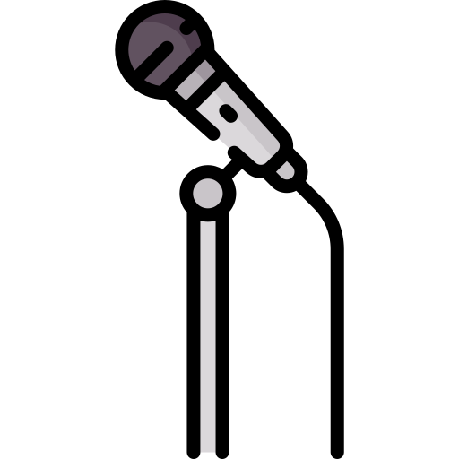

# Sicherheitsrichtlinie

<a href="../SECURITY.md">English</a> · <b>Deutsch</b>
  

## Schwachstellen melden

Bitte vertraulich über GitHubs
[private Meldung](https://github.com/Ollornog/1pipe/security/advisories/new) statt über ein
öffentliches Issue. Eine erste Antwort kommt binnen einer Woche.

## Umfang und Entwurfsentscheidungen, die man kennen sollte

Die Anwendung wird noch gebaut; diese Richtlinie nennt die Entwurfsabsicht, an der ihr Code
gemessen wird.

- **Secrets kommen aus der Umgebung, nie aus dem Repo.** Chat-, Modell- und Archiv-Endpunkte und
  ihre Tokens werden aus Umgebungsvariablen gelesen. Das Repo liefert nur neutrale Beispiele.
- **Die Anmeldung ist ausgelagert** an [TinySesam](https://github.com/Ollornog/TinySesam) und einen
  OIDC-Anbieter. 1pipe speichert keine Passwörter.
- **Eine Nachricht aus dem Chat ist ungeprüfte Eingabe.** Die Brücke schützt davor, die eigenen
  Nachrichten zu beantworten (eine Webhook-Schleife), und behandelt jede eingehende Nachricht als
  angreiferkontrollierten Text, bevor sie ein Werkzeug erreicht.
- **Verändernde Aktionen verlangen eine ausdrückliche Bestätigung.** Der Assistent löscht,
  klassifiziert oder schreibt nicht auf eine erschlossene Absicht hin; ein Ja/Nein-Schritt steht
  zwischen Vorschlag und Wirkung.
- **Connectoren sind nach Kanal beschränkt.** Ein Werkzeug, das die Registry einem Kanal nicht
  gewährt, ist von dort nicht erreichbar. Die Gewährung je Raum so klein halten, wie der Raum sie
  braucht.

## Nicht im Umfang

Die Sicherheit der Drittdienste, mit denen sich 1pipe verbindet (Chat-Server, Modell-Anbieter,
Archiv), und alles, was ein angemeldeter Betreiber von Natur aus darf.

  

